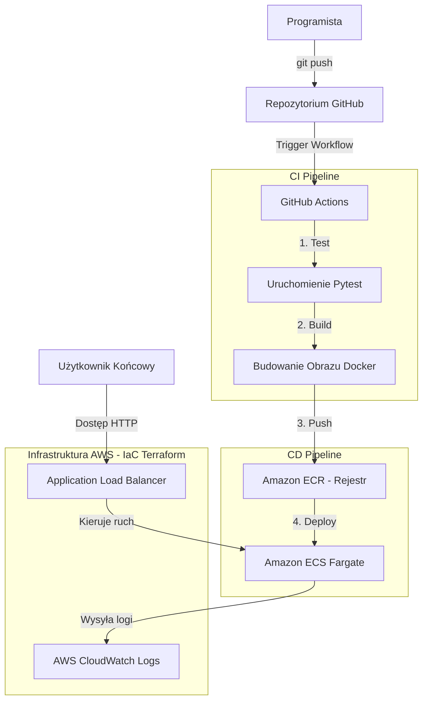

# 🌲 Stokklukeanalyse - Projekt Dyplomowy DevOps

Projekt zaliczeniowy z przedmiotu **DevOps** realizujący kompletny proces automatycznego testowania, budowania i wdrażania aplikacji analitycznej w chmurze AWS przy użyciu praktyk CI/CD oraz infrastruktury jako kodu (IaC).

---

## 🔍 Opis Projektu
Aplikacja **Stokklukeanalyse** służy do statystycznej analizy wielkości luk w kłodach (szw. *StoLucka*) podczas procesu cięcia w tartakach. Pozwala ona na szybkie wyznaczanie stabilności i zdolności procesu produkcyjnego (wskaźniki Six Sigma: **Cp i Cpk**) oraz automatyczne identyfikowanie anomalii produkcyjnych metodą IQR (Interquartile Range).

Aplikacja została zbudowana w architekturze jednoplikowego pulpitu nawigacyjnego (Single Page Application):
* **Backend:** Szybki i wydajny serwer REST API napisany w **FastAPI (Python)**.
* **Frontend:** Nowoczesny, interaktywny i responsywny interfejs użytkownika (Dark/Slate Mode, glassmorphism) z wykresami generowanymi w przeglądarce za pomocą **Chart.js** (histogram rozkładu, run chart przebiegu procesu, wykres punktowy korelacji długości kłody z luką wraz z linią trendu OLS).

---

## 🏗️ Architektura Rozwiązania
Proces wdrożenia i przepływu danych przedstawia się następująco:



---

## 📁 Struktura Projektu
```text
stokklukka/
├── .github/workflows/
│   └── deploy.yml            # Definicja potoku CI/CD GitHub Actions
├── .devcontainer/            # Konfiguracja środowiska Dev Container
├── app/                      # Kod źródłowy aplikacji
│   ├── main.py               # Backend FastAPI (REST API i routing)
│   └── static/               # Frontend statyczny (HTML/CSS/JS)
│       ├── index.html        # Struktura i elementy interfejsu
│       ├── style.css         # Motyw graficzny, układ i animacje
│       └── app.js            # Logika UI, wywołania API i Chart.js
├── terraform/                # Infrastruktura jako Kod (IaC)
│   ├── main.tf               # Definicje zasobów AWS (VPC, ECS, ALB)
│   ├── variables.tf          # Zmienne konfiguracyjne regionu i projektu
│   └── outputs.tf            # Dane wyjściowe (np. adres URL aplikacji)
├── tests/                    # Testy automatyczne
│   └── test_main.py          # Testy jednostkowe pytest
├── Dockerfile                # Instrukcja budowania obrazu kontenera
├── requirements.txt          # Zależności biblioteczne Pythona
└── README.md                 # Ta dokumentacja
```

---

## ⚙️ Wymagane punkty końcowe (Endpoints)
Zgodnie z wymaganiami projektu, aplikacja wystawia następujące adresy API:
1. **`/health`** [GET] - Służy do monitorowania żywotności kontenera i jest odpytywany przez Load Balancer (Health Check). Zwraca: `{"status": "healthy", "service": "stokklukeanalyse"}`.
2. **`/version`** [GET] - Zwraca aktualną wersję aplikacji (przydatne przy weryfikacji wdrożeń CI/CD). Zwraca: `{"version": "1.0.0"}`.
3. **`/api/analyze`** [POST] - Główny punkt biznesowy. Przyjmuje plik Snap.txt i parametry analizy, po czym zwraca komplet danych statystycznych oraz współrzędne dla wykresów w formacie JSON.

---

## 💻 Instrukcja Uruchomienia Lokalnego

### Opcja A: Tradycyjne środowisko wirtualne Python
1. Upewnij się, że masz zainstalowanego Pythona (zalecany 3.10+).
2. Stwórz i aktywuj środowisko wirtualne:
   ```bash
   python -m venv .venv
   # Windows:
   .venv\Scripts\activate
   # Linux/macOS:
   source .venv/bin/activate
   ```
3. Zainstaluj wymagane pakiety:
   ```bash
   pip install -r requirements.txt
   ```
4. Uruchom serwer deweloperski:
   ```bash
   uvicorn app.main:app --reload --port 8000
   ```
5. Otwórz w przeglądarce adres: [http://localhost:8000](http://localhost:8000).

### Opcja B: Uruchomienie lokalne w kontenerze Docker
1. Zbuduj obraz kontenera:
   ```bash
   docker build -t stokklukka .
   ```
2. Uruchom kontener:
   ```bash
   docker run -d -p 8080:80 --name stokklukka-container stokklukka
   ```
3. Wejdź na adres: [http://localhost:8080](http://localhost:8080).

### Uruchomienie testów lokalnych
Aby uruchomić testy jednostkowe w środowisku wirtualnym, wpisz:
```bash
python -m pytest
```

---

## ☁️ Wdrożenie Infrastruktury na AWS (IaC Terraform)

Infrastruktura jest tworzona i uruchamiana **lokalnie z Twojego komputera**, co zapewnia pełną kontrolę i minimalizację kosztów.

### Krok 1: Przygotowanie poświadczeń AWS
Musisz posiadać aktywne konto AWS oraz skonfigurowane poświadczenia na swoim komputerze (np. poprzez plik `~/.aws/credentials` lub zmienne środowiskowe po zainstalowaniu AWS CLI).

### Krok 2: Uruchomienie Terraform
1. Przejdź do katalogu `terraform`:
   ```bash
   cd terraform
   ```
2. Zainicjalizuj Terraform (pobierze wtyczki dostawcy AWS):
   ```bash
   terraform init
   ```
3. Sprawdź poprawność planowanych zmian:
   ```bash
   terraform plan
   ```
4. Zastosuj zmiany w chmurze AWS (stworzy VPC, ALB, ECR i ECS Cluster):
   ```bash
   terraform apply
   ```
   *Wpisz `yes`, aby zatwierdzić operację.*

Po zakończeniu działania (ok. 2-3 minuty), Terraform wyświetli w terminalu dwa kluczowe parametry (Outputs):
* **`ecr_repository_url`** – adres URL rejestru obrazów (skopiuj go).
* **`application_url`** – publiczny adres URL Load Balancera (ALB), pod którym dostępna będzie Twoja aplikacja po uruchomieniu pipeline'u.

---

## 🔄 Konfiguracja Pipeline CI/CD (GitHub Actions)

Potok wdrożeniowy w GitHub Actions automatycznie kompiluje, testuje i dostarcza poprawki na serwer ECS Fargate.

### Krok 1: Umieszczenie kodu na GitHubie
Utwórz repozytorium na GitHubie i wypchnij tam kod swojego projektu:
```bash
git init
git add .
git commit -m "Initial commit - DevOps structure"
git branch -M main
git remote add origin <TWÓJ_LINK_DO_GITHUB>
git push -u origin main
```

### Krok 2: Konfiguracja GitHub Secrets
W swoim repozytorium na GitHubie wejdź w zakładkę **Settings** -> **Secrets and variables** -> **Actions** i dodaj trzy sekrety (Repository Secrets):
1. **`AWS_ACCESS_KEY_ID`** – Twój identyfikator klucza dostępu AWS.
2. **`AWS_SECRET_ACCESS_KEY`** – Twój tajny klucz dostępu AWS.
3. **`AWS_REGION`** – Region wdrożenia (domyślnie `eu-central-1`).

### Krok 3: Działanie Pipeline'u
Po każdym kolejnym wypchnięciu kodu do gałęzi `main` (`git push`), GitHub Actions uruchomi potok:
1. Uruchomi testy pytest (weryfikacja kodu).
2. Zaloguje się do ECR i zbuduje kontener produkcyjny z nowym tagiem.
3. Wypchnie obraz do AWS ECR.
4. Zaktualizuje definicję zadania (Task Definition) w usłudze ECS.
5. Przeprowadzi bezpieczną aktualizację kontenera na Fargate (Rolling Update).

---

## 📊 Obserwowalność (Observability)

* **Status:** Działający endpoint `/health` na porcie 80 pozwala na monitoring stanu kontenera.
* **Logi aplikacji:** Wszystkie logi (zarówno z FastAPI, jak i z serwera Uvicorn) są automatycznie przekazywane do usługi **Amazon CloudWatch Logs** w grupie logów `/ecs/stokklukka`. Logi można przeglądać bezpośrednio w konsoli chmury AWS.

---

## 🔗 Link do działającej aplikacji
Po wdrożeniu infrastruktury i pomyślnym wykonaniu pierwszego pipeline'u, Twoja aplikacja będzie dostępna pod publicznym adresem:
👉 **[Publiczny adres URL Load Balancera (ALB)]** *(Wpisz tutaj swój wygenerowany outputs.application_url)*
